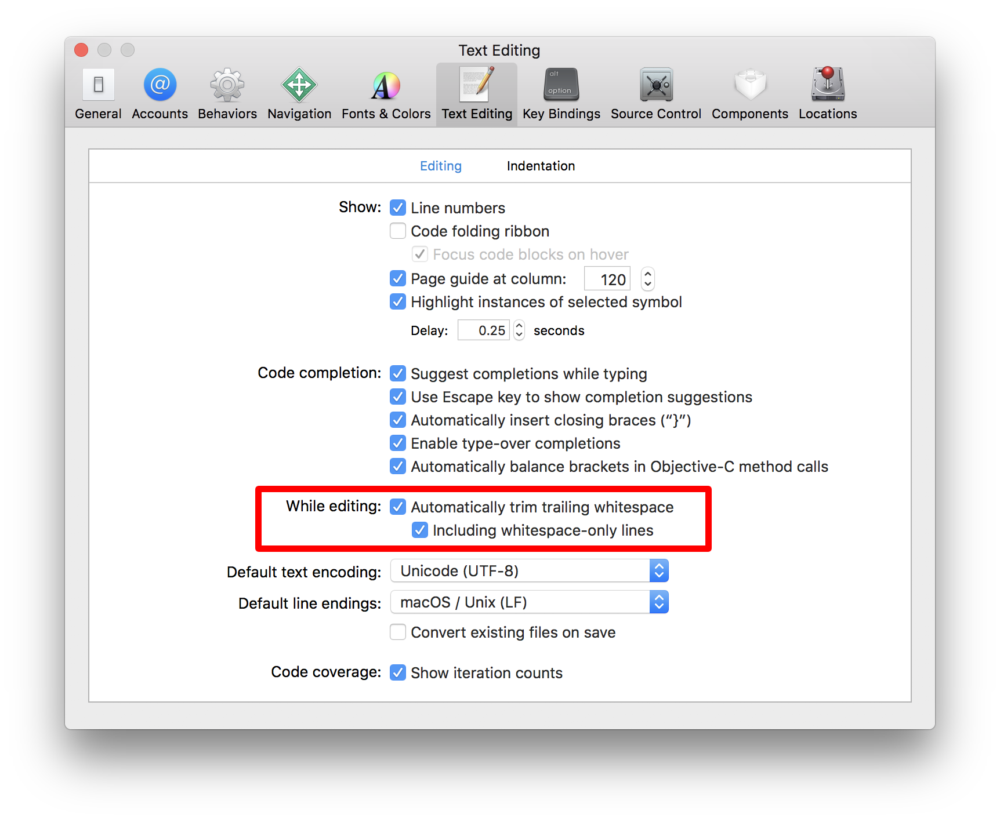

This document describes the Swift coding style used on the Swift Package Manager project. It provides a set of rules for all contributors to follow and promotes a consistence that helps when reading code written by different people. This is a living document that should be updated as the style evolves and solidifies.

When necessary, break the rules to improve readability.

<!-- START doctoc generated TOC please keep comment here to allow auto update -->
<!-- DON'T EDIT THIS SECTION, INSTEAD RE-RUN doctoc TO UPDATE -->


- [General](#general)
  - [Follow the official API Design Guidelines](#follow-the-official-api-design-guidelines)
  - [Fix all warnings](#fix-all-warnings)
  - [Prefix source files with the copyright header](#prefix-source-files-with-the-copyright-header)
  - [Use type indicators sparingly and prefer typing the variable than the value](#use-type-indicators-sparingly-and-prefer-typing-the-variable-than-the-value)
  - [Provide a message for assertions and preconditions](#provide-a-message-for-assertions-and-preconditions)
  - [Limit uses of forced unwrapping and casting](#limit-uses-of-forced-unwrapping-and-casting)
  - [Prefer exhaustive cases to default in switch statements](#prefer-exhaustive-cases-to-default-in-switch-statements)
- [Naming](#naming)
  - [Use same-name shadowing in conditional binding](#use-same-name-shadowing-in-conditional-binding)
  - [Use `()` for parameters and `Void` for return types](#use--for-parameters-and-void-for-return-types)
- [Formatting](#formatting)
  - [Omit semicolons](#omit-semicolons)
  - [Avoid long lines of code and limit them to 120 characters](#avoid-long-lines-of-code-and-limit-them-to-120-characters)
  - [When wrapping function calls and declaration, indent each argument on a line of its own](#when-wrapping-function-calls-and-declaration-indent-each-argument-on-a-line-of-its-own)
  - [When wrapping function declarations, place the closing parentheses on a line of its own](#when-wrapping-function-declarations-place-the-closing-parentheses-on-a-line-of-its-own)
  - [Open braces on the same line but close on a newline](#open-braces-on-the-same-line-but-close-on-a-newline)
  - [When wrapping statement conditions, open braces on a newline](#when-wrapping-statement-conditions-open-braces-on-a-newline)
  - [Only use the trailing closure syntax for procedural arguments](#only-use-the-trailing-closure-syntax-for-procedural-arguments)
  - [Format multiline collections with trailing commas and dangling brackets](#format-multiline-collections-with-trailing-commas-and-dangling-brackets)
  - [Indent code using 4 spaces](#indent-code-using-4-spaces)
  - [Remove all trailing whitespace (even on empty lines)](#remove-all-trailing-whitespace-even-on-empty-lines)
  - [Follow conventional spacing for lists](#follow-conventional-spacing-for-lists)
  - [Hug colons to the left and follow with a space](#hug-colons-to-the-left-and-follow-with-a-space)
  - [Insert internal spaces inside closures](#insert-internal-spaces-inside-closures)
  - [Separate functions and top-level scopes with one empty line](#separate-functions-and-top-level-scopes-with-one-empty-line)
  - [When chaining function calls, indent each call on its own line](#when-chaining-function-calls-indent-each-call-on-its-own-line)
- [Code Organization](#code-organization)
  - [Remove unused code and stale comments](#remove-unused-code-and-stale-comments)
  - [Use extensions to organize code into logical blocks of functionality](#use-extensions-to-organize-code-into-logical-blocks-of-functionality)
  - [Use extensions to group protocol conformances](#use-extensions-to-group-protocol-conformances)
  - [Use extensions to group members with the same visibility](#use-extensions-to-group-members-with-the-same-visibility)
- [Comments](#comments)

<!-- END doctoc generated TOC please keep comment here to allow auto update -->

# General

## Follow the official API Design Guidelines

The official [API Design Guidelines](https://swift.org/documentation/api-design-guidelines) are a short and high-level summary of the most important naming and code conventions used among Swift developers. It is important to follow them so that code in the Swift Package Manager feels consistent with the Standard Library and other third-party libraries. The fundamentals are resumed as:

* Clarity at the point of use is your most important goal.
* Clarity is more important than brevity.
* Write a documentation comment for every declaration.

## Fix all warnings

The warnings generated by the Swift compiler exist for a reason. Fixing them often results in better code and makes sure that new warnings are spotted immediately.

## Prefix source files with the copyright header

```swift
/*
 This source file is part of the Swift.org open source project
 Copyright (c) 2014 - 2017 Apple Inc. and the Swift project authors
 Licensed under Apache License v2.0 with Runtime Library Exception
 See http://swift.org/LICENSE.txt for license information
 See http://swift.org/CONTRIBUTORS.txt for Swift project authors
*/
```

## Use type indicators sparingly and prefer typing the variable than the value

Generally, we make a distinction between local variables and properties. In the case of variables, use type indicators only if type inference generates the wrong type. For properties, always be explicit about the type. In all cases, prefer typing the variable than the value when possible.

```swift
let name = "David" // Doesn't require typing to be explicit
let height: Float = 1.75 // Requires typing to force to Float
var people: [Person] = [] // Initialize empty collections with the empty literal

struct Person {
    let name: String = "John" // Always be explicit for properties
    var height: Float = 1.7
    var friend = Person(name: "Jane", height: 1.6) // Don't repeat type information

    // ...
}
```

## Provide a message for assertions and preconditions

Providing a custom message for assertions and preconditions to be explicit about what is being tested.

## Limit uses of forced unwrapping and casting

Avoid forced unwrapping or casting whenever possible. Only do so when it is expected for the value to exist/be of the target type. Failure should indicate programmer error. Otherwise, guard against it and handle the off-case accordingly.

## Prefer exhaustive cases to default in switch statements

Following this rules allows the compiler to point to us the switchs missing an implementation when we add case a new case. For example, in the following example, this was achieved by inserting semi-wildcard cases:

```swift
public static func == (lhs: DependencyResolverError, rhs: DependencyResolverError) -> Bool {
    switch (lhs, rhs) {
    case (.unsatisfiable, .unsatisfiable):
        return true
    case (.unsatisfiable, _):
        return false
    case (.revisionConstraints(let lDependency, let lRevisions),
          .revisionConstraints(let rDependency, let rRevisions)):
        return lDependency == rDependency && lRevisions == rRevisions
    case (.revisionConstraints, _):
        return false
    }
}
```

## Mark classes as final when they are not deigned for inheritance

Marking a class as final is both an indication to readers that no inheritance is expected and a hint to the compiler to do more agressive optimizations. Use it whenever a class has not been designed for inheritance.

# Naming

## Use same-name shadowing in conditional binding

This unambiguously connects both variables as two views of the same data:

```swift
func process(input: String?) {
    guard let input = input else {
        return
    }

    // ...
}
```

When dealing with a weak self reference in a closure, one can shadow self using backticks:

```swift
Dispatch.main.async { [weak self] in
    guard let `self` = self else { return }
    // ...
}
```

## Use `()` for parameters and `Void` for return types

```swift
let closure: () -> Void = { print("Hello") }
```

## Use type inferencing when accessing static members

Adding type information in those cases adds no meaningful information and worsens readability.

```swift
"left".compare("right", options: [.caseInsensitive, .literal], locale: .current)
```

## Omit acessing members through self when possible

The compiler requires accessing members through `self` as a visual guide when the instance is strongly referenced in an escaping closure. Limiting uses of `self` to those cases makes sure they stick out.

# Formatting

## Omit semicolons

Traditional Swift code avoids semicolons. They are unnecessary and hinder readability.

## Avoid long lines of code and limit them to 120 characters

Long lines of code can be difficult to read. If possible, prefer splitting them into separate statements. If not, hard-wrapping ensures that we stay consistent in the presentation. The limit of 120 characters was chosen to be the most generous length that still fits in GitHub diffs without vertical scrolling.

```swift
let error = WorkspaceDiagnostics.MismatchingDestinationPackage(
    editPath: destination,
    expectedPackage: packageName,
    destinationPackage: manifest?.name)
```

## When wrapping function calls and declaration, indent each argument on a line of its own

This style helps align arguments when they are many to read.

```swift
parser.add(
    position: "executable",
    kind: String.self,
    optional: true,
    strategy: .remaining,
    usage: "Executable to run")
```

## When wrapping function declarations, place the closing parentheses on a line of its own

By following this style, the body to stays visually separate from the declaration.

```swift
func add<T: ArgumentKind>(
    positional: String,
    kind: [T].Type,
    optional: Bool = false,
    strategy: ArrayParsingStrategy = .upToNextOption,
    usage: String? = nil
) -> PositionalArgument<[T]> {
    let argument = PositionalArgument<[T]>(name: positional, strategy: strategy, optional: optional, usage: usage)
    positionalArguments.append(AnyArgument(argument))
    return argument
}
```

## Open braces on the same line but close on a newline

```swift
func add(_ values: [ArgumentKind], for argument: AnyArgument) throws {
    if argument.isArray {
        results[argument, default: []].append(contentsOf: values)
    } else {
        results[argument] = values[0]
    }
}
```

## When wrapping statement conditions, open braces on a newline

As with the wrapping rules of function declaration, this style helps distinguish the body from the condition.

```swift
if let maxArgument = (positionalArguments + optionArguments).map({ $0.name.characters.count }).max(),
    maxArgument < maxWidthDefault
{
    maxWidth = maxArgument + padding + 1
} else {
    maxWidth = maxWidthDefault
}
```

## Only use the trailing closure syntax for procedural arguments

This is essentially the Rule of Kevin (Ballard): "When a trailing closure argument is functional, use parentheses. When it is procedural, use braces." Functional closures are recognized as outputting some transformation on their input without generating any side-effect. `map`, `flatMap`, `reduce`, `contains` are all examples of functions which work on functional closures.

```swift
// Procedural, trailing closure
Dispatch.main.async {
    // Functional, no trailing closure
    print(array.flatMap({ Int($0) }))
}
```

## Format multiline collections with trailing commas and dangling brackets

```swift
let colors: [String: Color] = [
    "white": .white,
    "pink": UIColor(hex: 0xFFAAAA),
    "green": UIColor(hex: 0xAAFFAA),
    "cyan": UIColor(hex: 0xAAAAFF),
]
```

## Indent code using 4 spaces

Indenting with 4 spaces is the standard used all over the Swift community.

## Remove all trailing whitespace (even on empty lines)

Trailing whitespace result in un-necessary noise when reading diffs. Most code editors have a setting to remove them automatically.

<details>
  <summary>Xcode Trailing Whitespace Setting</summary>
  
</details>

## Follow conventional spacing for lists

Parentheses and angle and square brackets don't have internal space. For commas, hug to the left and follow with a space:

```swift
min(a, b) // Argument list
[x, y, z] // Array literal
Dictionary<Key, Value> // Generic parameter list
enum Shell: String, StringEnumArgument { ... } // Inheritance list
```

## Hug colons to the left and follow with a space

One minor exception to this rule is the empty dictionary literal `[:]`:

```swift
struct PathArgument: ArgumentKind { ... }
let mapping: [String: Int] = ["one": 1, "two": 2]
```

## Insert internal spaces inside closures

Furthermore, non-trailing closures follow the same spacing rules as any other argument and trailing closures are prefixed with a space.

```swift
array
    .map({ $0.lowercased })
    .forEach { print($0) }
```

## Separate functions and top-level scopes with one empty line

```swift
public class GridPoint {
    public let x: Double
    public let y: Double

    public init(x: Double, y: Double) {
        self.x = x
        self.y = y
    }
}

// MARK: - Public Members
public extension {
    var hashValue: Int {
        return x.hashValue ^ y.hashValue
    }
 
    static func ==(lhs: GridPoint, rhs: GridPoint) -> Bool {
        return lhs.x == rhs.x && lhs.y == rhs.y
    }
}
```

## When chaining function calls, indent each call on its own line

```swift
return items
    .sorted(by: { (lhs, rhs) in lhs.0 < rhs.0 })
    .map({ key, value in
        let serialized = value.serializer() 
        return "\(key) = \(value) "
    })
    .joined(separator: "; ")
```

# Code Organization

## Remove unused code and stale comments

Source control allows us to keep of trace of everything that was once committed.

## Use extensions to organize code into logical blocks of functionality

Extensions are a natural way to group together members of a type. Prefix them with `// MARK: - ` followed by a capitalized title not ending with punctuation.

## Use extensions to group protocol conformances

```swift
// MARK: - Hashable Conformance
extension GridPoint: Hashable {
    var hashValue: Int {
        return x.hashValue ^ y.hashValue
    }
 
    static func == (lhs: GridPoint, rhs: GridPoint) -> Bool {
        return lhs.x == rhs.x && lhs.y == rhs.y
    }
}
```

## Use extensions to group members with the same visibility

Grouping members with the same visibility and using the extension's visibility propagation feature encourages developers to move members to the correct group when changing their visibility:

```swift
// MARK: - Public Members
public extension GridPoint {
    func distance(to other: GridPoint) -> Double {
        return sqrt(distanceSquared(to: other))
    }
}

// MARK: - Private Members
private extension GridPoint {
    func distanceSquared(to other: GridPoint) -> Double {
        let deltaX = other.x - x
        let deltaY = other.y - y
        return deltaX * deltaX + deltaY * deltaY
    }
}
```

# Comments

* Don't need them for protocol conformances